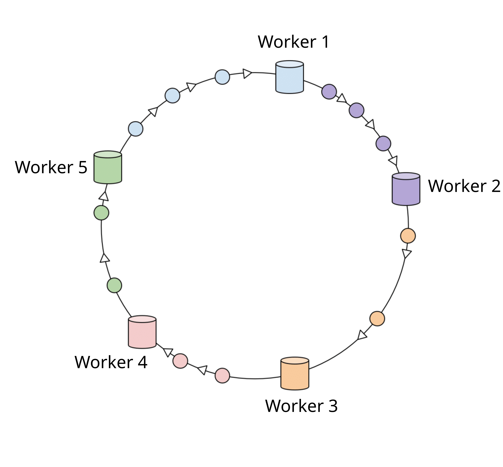
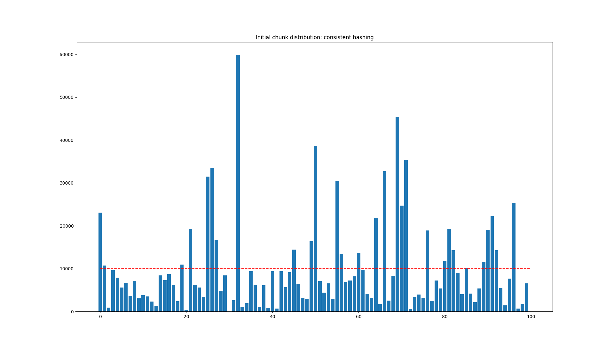
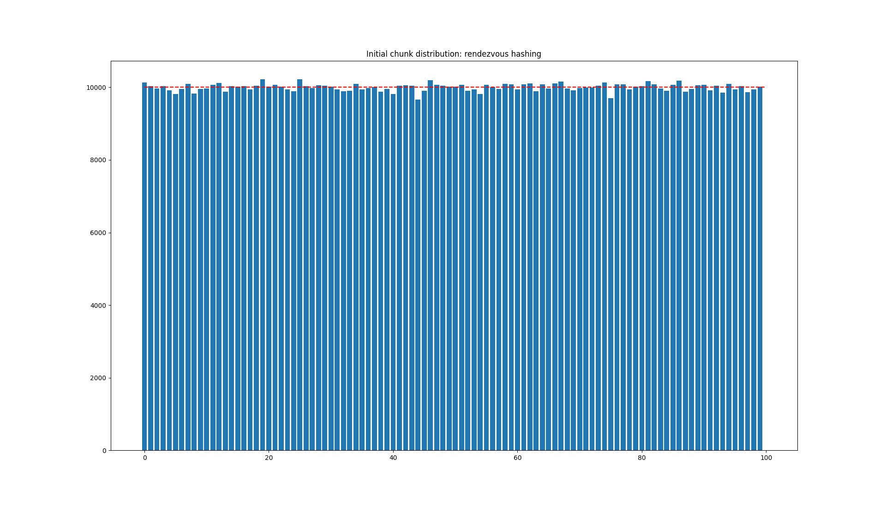
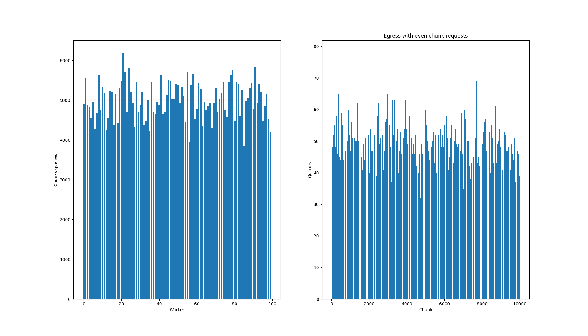
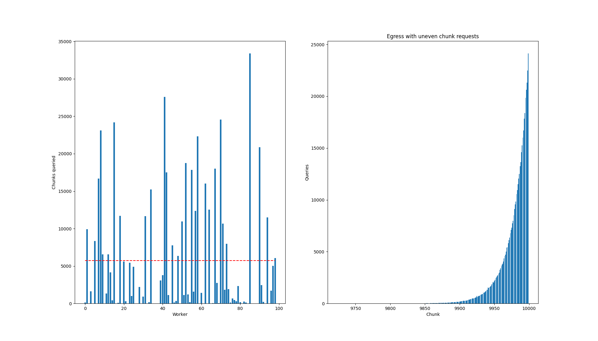
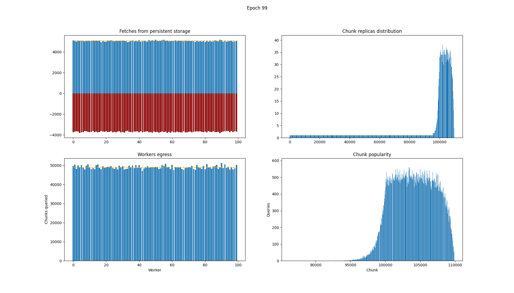

<style>
.columns {
    display: flex;
    gap: 1em;
}
.column {
}
.center {
    text-align: center;
}
</style>

# Solution description
> _Each randomized algorithm can be replaced by a deterministic one. We're just not intelligent enough to find it._

## Problem statement
[Original statement](https://gist.github.com/dzhelezov/d10c86cf3aa6e5d1ab1ccbe9eb23cceb)

In brief, the task was to design a scheduling algorithm assigning data chunks to workers so that the chunks are fetched and queried evenly.

## Assumptions
The solution assumes the following things for simplicity and due to the lack of information:
- Chunks are independent. I.e., a probability of chunk access does not depend on whether some other chunk was adressed by the same query or not.
- Chunks are approximately equal in terms of query response egress. The solution takes into account only the number of chunks queried and assumes that it represents network "egress" well enough. In other words, it's assumed that each query works similar to a single chunk download, without any complex preprocessing.
- Every chunk should be stored by at least one worker, even if it is unlikely to be accessed.

## Simple algorithm
If all the chunks were equaly popular among the clients, the problem would be trivial and could be solved by a classical [consistent hashing](https://en.wikipedia.org/wiki/Consistent_hashing) algorithm that works as follows.

- Each worker is assigned a deterministic random number (hash) from `0` to `M` and is said to be located on the ring of size `M` by that.
- Each chunk is assigned a hash _on the same ring_ from `0` to `M`.
- Each chunk is then assigned to the nearest worker clockwise from the chunk's hash position.

It's easy to see that this way old chunks are always distributed to the same workers and in case of worker (dis-)appearance a minimal amount of chunks is redistributed.

<div class="center">
    </img>
</div>

### Rendezvous hashing
In practice [rendezvous hashing](https://en.wikipedia.org/wiki/Rendezvous_hashing) should be used instead because it gives much better chunk distribution among workers, preserving the good qualities mentioned above.\
It's only disadvantage is the time complexity, but it is still fast enough for the real-world application.

<div class="columns">

<div class="column">

##### Chunk distribution with consistent hashing

</div>

<div class="column">

##### Chunk distribution with rendezvous hashing

</div>
</div>

Rendezvous hashing works as follows.
- For each chunk and each worker a hash of the pair `(chunk_id, worker_id)` is computed.
- Each chunk is assigned to the worker giving the lowest value of those hashes.

## Considering chunk popularity
In real world chunks are not accessed evenly. For example, if chunks are formed from consequent blocks in blockchain history then newer ones would probably be accessed more frequently because the newest information is often more useful than older one.

The following comparison demonstrates how the mentioned algorithm fails to provide even worker access under uneven chunk popularity distribution.

<div class="center">
    </img>
    </img>
</div>

In order to improve the assignment quality it is required to know (or at least estimate) distribution of chunks popularity before forming an assignment.

Therefore it is also **assumed** that not only the number of chunks by the chunk ids themselves are logged for each query.\
With that data it can be estimated which chunks will be more popular in further requests.


## Final algorithm
The idea is to store each chunk on multiple workers. The number of workers holding the chunk should be proportional to its estimated access frequency. If chunk `A` is accessed twice as often as chunk `B` then splitting requests to `A` between two workers should make access even again.

Of course that would make each worker store more information, but at least some amount of replication is always beneficial for any distributed system. The simulation shows that a replication factor of `2` (each worker has twice as much chunks on average than it would get with uniform distribution) is already enough to make egress distributed very well if most chunks are accessed very rarely.

The choice of extra workers for each chunk is a natural extension of mentioned algorithms.
- In case of consistent hashing the first `k` workers clockwise from the chunk hash should be used.
- In case of rendezvous hashing the lowest `k` hash values should be chosen.

With the consistent hashing it should be noted that if multiple "fat" chunks are hashed close to each other it will make multiple workers download all of them hence skewing the distribution. No such problem exists for rendezvous hashing because each chunk has its own order of workers in its case.

```python
# Find an integer distribution approximating a given one but
# with the average value equal to `replication_factor`.
chunk_replicas = scale_distribution(historical_distribution, replication_factor)

for chunk_id in chunks:
    replicas = chunks_replicas[chunk_id]
    hashes = sorted((hash(f"{chunk_id}:{worker_id}"), worker_id) for worker_id in workers)
    for _, worker_id in hashes[:replicas]:
        assign(worker_id, chunk_id)
```

### Simulation results
A simulation was held with the following parameters:

| Parameter | value |
|-----------|-------|
| Epochs | `100`|
| Chunks | `100000` (for the sake of performance)|
| Workers | `100`|
| Clients | `1000`|
| New chunks added per epoch |`100`|
| Workers | not replaced |
| Chunks popularity distribution | each new chunk is $0.1\%$ more popular than the previous one |
|||

The following observations are visualized:
- Total fetches from persistent storage and total chunk drops by each worker
- Chunk replicas count at the last epoch
- Total number of queries (1 query — 1 chunk access) processed by each worker
- Total number of times each chunk was queried during the simulation



It can be seen that both task requirements are satisfied: fetches from the storage and queries are distributed almost perfectly among workers.

### Limitations
- This implementation doesn't work well with freshly added chunks because they do not have access history and only one replica per such chunk is used. In practice it might be better to predict chunk popularity by other means.

### Further extensions
- The algorithm can be modified to dynamically adjust chunk replicas on the fly based on realtime workers load instead of once per epoch.

## Source code
Source code with implementation and simulation can be found [here](https://github.com/kalabukdima/scheduler-design)

## Thanks for your attention!
